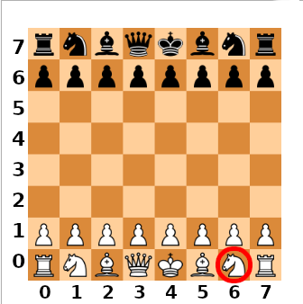

In this exercise you will create a class representing a chessboard and a collection of classes representing various pieces.

**You don't need to know how to play chess. The instructions and automated tests will ensure you exactly know what to program.**

*We are not going to implement all the rules of chess: volunteers can include the advanced ones (pawn promotion, en passant, castling, etc.).  We will also simplify the endgame (at least from a point of view of programming): the king needs to be captured in the same way as the other pieces.* 

There are unit tests for this exercise that can be run after, or even before completing each stage of the exercise. You will learn how to do it in the second stage.

## Class `Chessboard`

We are going to need a `Chessboard` class, that the players will use to affect the positions of the pieces. This class will take no arguments. The instance of the `Chessboard` class should get the following attributes:
- `color` with a value of `"white"` to store which player has the next move (during the game it will switch to`"black"`, then to`"white"` and so on),
- `board` with a value (at this stage of writing code) of a list of eight lists: each internal list should have eight `None` values.

The coordinate system of our chessboard looks like the picture below. The first value will be the column number; the second one: the row number, so`board[6][0]` (counting from zero!) will point at the white knight, the bottom right corner of the board, in the picture.



[Moves of particular pieces are described here.](https://en.wikipedia.org/wiki/Chess#Movement)

Tests for this stage are already enabled.


## Class `Pawn` (tests: `TEST_PAWNS`)

This class will represent pawns. Each pawn needs to know its color (`"white"` or `"black"`) and its current position (`x` and `y` with values from 0 to 7). All of the information will be passed to it with the `__init__` method.

To turn on the tests for this stage, in the `test_chess.py` file change the value of the `TEST_PAWNS` variable to `True`.

**Write the class** `Pawn`, with the `__init__` method that takes three arguments: `color`, `x` and `y`. Store them in the instance with these names.

**Write a method** `list_allowed_moves(chessboard)`, that returns a list of tuples: each tuple is going to have two numbers: the coordinates `(x, y)` that a certain piece can move to. Remember that traditionally, white pawns are at the bottom of the board (in row number 1, as shown in the picture above) and move by one square towards rows with higher numbers while black move in towards the lower numbered rows. Additionally, **only** in its first move each pawn **may** advance two squares.

To the `list_allowed_moves(...)` method we are going to pass the whole board: thanks to that a pawn will be able to "look around" and check where it can move. For now let's assume there's only one pawn on the board: we will return to looking around later.

So a white pawn at `(x, y)` can move to`(x, y+1)`, and if it is its first move, the player can choose `(x, y+1)` or `(x, y+2)`. For a black pawn the corresponding values would be `(x, y-1)` and `(x, y-1)` or `(x, y-2)`.

Remember that pawns should not fall off the edge of the board! Once a pawn reaches the edge of the board the `list_allowed_moves(...)` method should return an empty list (this is an exercise simplification of chess rules).

**Write method** `move(x, y)` that stores the new position the pawn has moved to: set the values of `self.x` and `self.y` to the ones passed to the method in the argument. Additionally, in the case of a pawn you also need to store that it has already moved: from now on it can only advance one square.

## Class `Knight` (tests: `TEST_KNIGHTS`)

This class will represent knights. Just like with pawns, the `__init__` method needs to take and store the color and coordinates of the knight it creates. [Here](https://en.wikipedia.org/wiki/Chess#Movement) You will learn the legal moves of a knight.

Write the `list_allowed_moves` and `move` methods here as well.

## Class `Rook` (tests: `TEST_ROOKS`)

That's a next class implementing the behavior of the next piece. Its interface must be compatible with the interfaces of other pieces: its `list_allowed_moves` and `move` methods must behave in the same way as those in the  `Pawn` and `Knight` classes. Also the `__init__` method should behave in the same way as the ones in previous classes.

## Class `King` (tests: `TEST_KINGS`)

Similarly to the earlier classes.

## A moment to refactor

Notice that in the code of (almost) every piece the `__init__` and `move` methods are repeated. Rather than copy that code, create one more class above the others: `Figure` and move both methods there. The pieces (pawn, knight, rook, etc.) will inherit from `Figure` and use its `__init__` and `move`methods.

Pawn is an exception: apart from the position and color it also needs to remember if it already moved. In the `__init__` method of the `Pawn` class use `super()` to take advantage of what the parent class offers and add what is missing.

There are no tests for this part of code. The ones that tested `Pawn`, `Knight`, `Rook` and `King` before are enough to confirm that the code works correctly after refactoring.

## Class `Bishop` (tests: `TEST_BISHOPS`)

Similarly to the earlier classes.

## Class `Queen` (tests: `TEST_QUEENS`)

Similarly to the earlier classes. Notice that the legal moves for the queen are a sum of the legal moves of bishops and rooks: rather than copy the code try to organize it appropriately. To do it you can add two more helper methods to the: `Figure` class: `_get_diagonal_moves(...)` and `_get_horizontal_and_vertical_moves(...)`. The underscores at the beginning of the names of these methods mean that they are used internally in the class and classes inheriting from it.


## Populating the board (tests: `TEST_BOARD_START`)

Until now the `board` attribute in the `Chessboard` type of objects contained a list of lists filled with `None` values: the board was completely empty.

Write a `setup()` method that populates the board with all pieces: only the four middle rows should remain empty.

## Displaying the chessboard on the screen

The function to display the board has been prepared but it needs all the classes of chess pieces to be created - that means it should work at this stage! The function is named `show(...)` and it requires passing the whole `Chessboard` object..

To make the exercise easier and not get confused with numbers let's assume the coordinates  **x** and **y** with values **from 0 to 7**, rather than the traditional **A-H** and **1-8**.

**Note! In the console with black background the black pieces may be displayed in white and the white ones in black!**


## `Chessboard` Class interface - `list_allowed_moves` method (tests: `TEST_BOARD_LISTING_MOVES`)

Until now only the pieces had the `list_allowed_moves` method. During the execution of the program we are not going to interact directly with the pieces: all decisions of the players will be received by the instance of the `Chessboard` class and it will make sure that its own state complies with the state of the piece, and that the game follows the rules.

To the `Chessboard` class add a `list_allowed_moves(x, y)` method that will return the list of moves that the piece indicated by `x` and `y` can do. The method should reach out to the piece on the board, ask it where it can move, and then return that information.

NOTE:
- if the color of the indicated piece is different than the color of the active player, the method should return `None`,
- if there is no piece in the  indicated square, the method should return `None`.

You will find the color of the active player in the `color` attribute of the `Chessboard` instance.


## `Chessboard` Class interface - `move` method (tests: `TEST_BOARD_MOVING`)

The `move` method in the `Chessboard` class will take 4 arguments:
- coordinate `from_x` of the piece to be moved
- coordinate `from_y` of the piece to be moved
- target coordinate `to_x`
- target coordinate `to_y`

The method must check (using the `list_allowed_moves` of the board), if the piece at `(from_x, from_y)` can legally move to `(to_x, to_y)`. If so it should call the `move` method **of the piece** (not the board!), to notify it of the change of its position, and next on the chessboard (i.e., in the `board`attribute) move the piece from the address `.board[from_x][from_y]` to the address `.board[to_x][to_y]`.

The move can be done in two steps:
1. to `.board[to_x][to_y]` assign the current value of `.board[from_x][from_y]`,
2. to `.board[from_x][from_y]` assign `None`.

After the piece moves the method should switch the  `color` of the board for the other player to make their move.

If the player wants to move in an illegal way the method should throw a `ValueError` exception.

At the end of its execution the method should return `None`. You don't need to type `return None`: at the end of a method (because it has no more code to execute), `None` is by default returned automatically.


## Restricting moves

Until now, the pieces assumed they were alone on the board when they generated the list of legal moves. Time to fix it:
1. pieces can only move over empty squares
2. a piece can capture (kill - replace on the board) a piece of the other player: but it cannot move over it,
3. a piece cannot capture nor move over another piece of the same color.

Only the `Knight` can jump over other pieces to reach the destination of its move.

The `Pawn` also needs special treatment: it can capture the other player's piece by moving one square diagonally forward.

Tests for this stage are:
- `TEST_PAWNS_KILLING_THE_ENEMY`
- `TEST_ROOKS_KILLING_THE_ENEMY`
- `TEST_KNIGHTS_KILLING_THE_ENEMY`
- `TEST_BISHOPS_KILLING_THE_ENEMY`
- `TEST_KINGS_KILLING_THE_ENEMY`
- `TEST_QUEENS_KILLING_THE_ENEMY`
- `TEST_PAWNS_NOT_KILLING_ALLIES`
- `TEST_ROOKS_NOT_KILLING_ALLIES`
- `TEST_KNIGHTS_NOT_KILLING_ALLIES`
- `TEST_BISHOPS_NOT_KILLING_ALLIES`
- `TEST_KINGS_NOT_KILLING_ALLIES`
- `TEST_QUEENS_NOT_KILLING_ALLIES`


## Detecting end of game (tests: `TEST_GAME_END`)

Detecting the end of the game is slightly simplified - the king must be captured. Once the king is captured, the `move` method of the `Chessboard` class should return `"WHITE WON"` or `"BLACK WON"`.

You can use the `type` function to check whether the piece (the one to be in a moment overwritten by the other player's piece) is an instance of a class:

```python
type(chess_figure_to_be_tested) == King
```

or the `isinstance` function:

```python
isinstance(chess_figure_to_be_tested, King)
```

# Summary

I hope this game has demonstrated to you the practical use of the four pillars of object-oriented programming. If you don't see them, a detailed description of how they were used follows:

## Abstraction

The functionality of each piece was reduced to the absolute minimum: it is enough for a class to have the `list_allowed_moves` and `move` methods, to meet the requirements of the chessboard and take part in the game.

The `Pawn`, `Rook`, `King`, etc. classes focus only on the logical aspect of the game - they don't even have methods to display themselves on the screen! Neither the `Chessboard` class has a method to display anything on the screen - `show` is a separate function. The `move` method of the `Chessboard` class does not use the `input()` function to ask the player to move - it expects "someone else" (e.g., the code in the `game.py` file) to provide the data it needs to work.

Dividing game logic from the communication with the user enables using the logic (`Chessboard` and all piece classes) in a variety of ways and in multiple places:
- a CLI application (i.e., `game.py`),
- a web app (e.g., using the `Flask` library),
- anywhere you can run Python code.

## Encapsulation

You will find examples of encapsulation in the `move` methods of `Chessboard` and all piece classes (or in the base `Figure` class if you have chosen to refactor the code). Each of these methods contains code that must execute in full, in strictly specified order to maintain the cohesion of all the objects' data. Just imagine what would happen if we forgot to update the coordinates of a single piece - it would "think" it is somewhere else than where the players see it on the screen!

## Inheritance

Inheritance let us organize the code in a clean way and eliminate repetitions: the `move` methods for different pieces were identical so it was enough to code them once (in the`Figure` class) and declare that`King`, `Queen`, etc., inherit from `Figure`. This means that `King`, `Queen`, etc., **inherited** the `move` method and can use it as if it was their own method.

## Polymorphism

We used Polymorphism to let the `Chessboard` class not be aware of everything about all the pieces on the board. Instead the `Chessboard` class "knows" that it can ask any piece about the list of its legal moves using `list_allowed_moves`, and inform it about its new coordinates using the `move` method.

Organizing code in this way makes it easy to expand the game with new types of pieces! You can try to add your own pieces (see the examples below) have fun - if you catch my drift - but remember that you will also need to update the `show` function):
- `Rabbit` - moves in all directions and can jump over pieces of the same and other color,
- `Polonez` - (an old brand of Polish car known for its inability to take sharp turns). Always advances two squares: can move in all directions but cannot make 90 degree turns (if it moves two squares forward, it cannot move left nor right in the next turn).
